# PBL4

## Lời nói đầu

Trong thời đại số hóa, việc tìm kiếm việc làm phù hợp và kết nối giữa ứng viên với nhà tuyển dụng vẫn còn nhiều khó khăn. Ứng viên thường phải truy cập nhiều trang web, điền thông tin lặp đi lặp lại, và không nhận được phản hồi kịp thời. Ngược lại, các công ty cũng gặp khó khăn trong việc quản lý hồ sơ ứng viên, đăng tin tuyển dụng hiệu quả, và tiếp cận đúng người tài.

Vì vậy, để giải quyết những vấn đề trên thì cần có một nền tảng kết nối việc làm thông minh, thân thiện và hiện đại. Dự án ra đời với mong muốn giúp ứng viên dễ dàng tìm kiếm, ứng tuyển, theo dõi trạng thái hồ sơ, đồng thời hỗ trợ doanh nghiệp quản lý tuyển dụng một cách chuyên nghiệp, tiết kiệm thời gian và chi phí.

Với giải pháp này, hành trình tìm việc và tuyển dụng sẽ trở nên dễ dàng, minh bạch và hiệu quả hơn bao giờ hết.

## Các đối tượng và chức năng của dự án

Hệ thống phục vụ ba nhóm đối tượng chính: Người dùng (ứng viên), Công ty (nhà tuyển dụng), và Quản trị viên. Mục tiêu là mang đến trải nghiệm đơn giản cho ứng viên, công cụ quản lý hiệu quả cho công ty, và khả năng giám sát, duy trì cho đội ngũ quản trị.

### Người dùng (Ứng viên)

- Tạo và quản lý hồ sơ cá nhân: điền thông tin, tải CV, cập nhật kỹ năng và kinh nghiệm.
- Tìm kiếm việc làm: lọc theo từ khóa, địa điểm, kỹ năng, mức lương.
- Xem chi tiết công việc: mô tả công việc, yêu cầu, thông tin công ty.
- Ứng tuyển trực tuyến: gửi hồ sơ nhanh chóng mà không phải lặp lại nhiều lần.
- Theo dõi công việc và trạng thái ứng tuyển: biết được trạng thái được xét duyệt, từ chối hoặc cần bổ sung thông tin.
- Nhận thông báo: hệ thống gửi thông báo về các thay đổi trạng thái ứng tuyển hoặc thông tin liên quan đến công việc mà người dùng quan tâm.

Lợi ích: giúp ứng viên tiết kiệm thời gian, quản lý hồ sơ rõ ràng và nâng cao cơ hội tìm được việc phù hợp.

### Công ty (Nhà tuyển dụng)

- Tạo và quản lý hồ sơ công ty: cập nhật thông tin, logo, liên hệ.
- Đăng và chỉnh sửa tin tuyển: dễ dàng đăng tin mới, cập nhật thông tin tuyển dụng.
- Quản lý đơn ứng tuyển: xem danh sách ứng viên, duyệt hoặc từ chối ứng tuyển, lưu trữ hồ sơ.
- Theo dõi hiệu suất tin tuyển: nắm thông tin số lượng ứng viên, trạng thái xử lý.

Lợi ích: giúp công ty tuyển dụng chuyên nghiệp hơn, giảm thời gian xử lý hồ sơ và tiếp cận ứng viên phù hợp.

### Quản trị viên

- Quản lý tổng thể nền tảng: quản lý người dùng, công ty, tin tuyển, và dữ liệu hệ thống.
- Giám sát và xử lý: kiểm duyệt nội dung, xử lý báo cáo và sự cố kỹ thuật.
- Quản lý thông báo và lịch sử: theo dõi thông báo hệ thống, lịch sử tương tác và các hoạt động quan trọng.
- Công cụ hỗ trợ vận hành: cài đặt, cấu hình các tác vụ theo dõi, và truy xuất dữ liệu khi cần.

Lợi ích: đảm bảo nền tảng hoạt động ổn định, an toàn và dữ liệu minh bạch cho người dùng và doanh nghiệp.

### Ghi chú về các công cụ mở rộng (dành cho Quản trị viên)

Hệ thống có tích hợp hai công cụ mở rộng dành riêng cho quản trị viên: Trợ lý AI (Chatbot) và Trình thu thập việc làm (Scraper). Hai công cụ này được coi là tiện ích vận hành—chỉ quản trị viên mới có quyền truy cập và sử dụng để hỗ trợ quản lý dữ liệu, kiểm duyệt và cải thiện chất lượng nguồn việc làm.

- Trợ lý AI (Chatbot): hỗ trợ xử lý câu hỏi phổ biến, rà soát nội dung cần kiểm duyệt và cung cấp trợ giúp nội bộ cho quản trị viên.
- Trình thu thập việc làm (Scraper): thu thập thông tin việc làm từ các nguồn công khai để bổ sung vào cơ sở dữ liệu; quản trị viên kiểm soát tần suất và nguồn lấy dữ liệu.

Những tiện ích này không thay đổi quyền hạn hoặc trải nghiệm của ứng viên và công ty — chúng là các công cụ nội bộ để giúp quản trị vận hành nền tảng tốt hơn.

## Sơ đồ Use Case

### Use Case Tổng quan

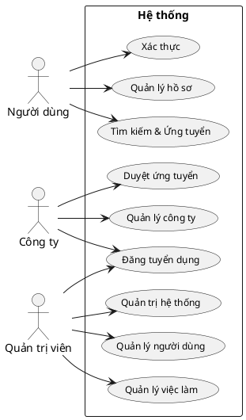

### Use Case Chi tiết - Người dùng

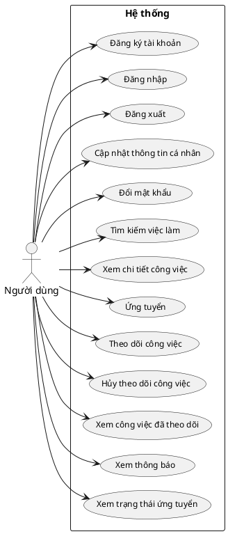

### Use Case Chi tiết - Công ty

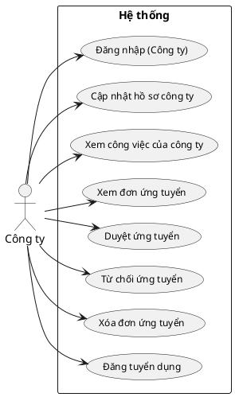

### Use Case Chi tiết - Quản trị viên

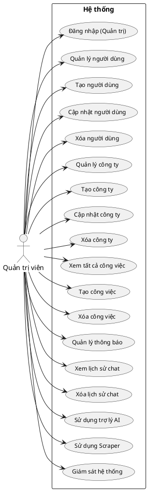

## Sơ đồ thực thể

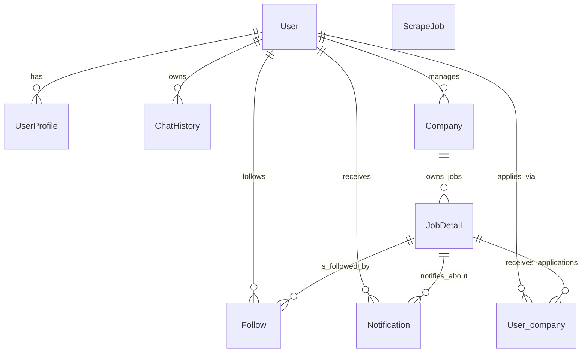

## Cấu trúc cơ sở dữ liệu

### Bảng User

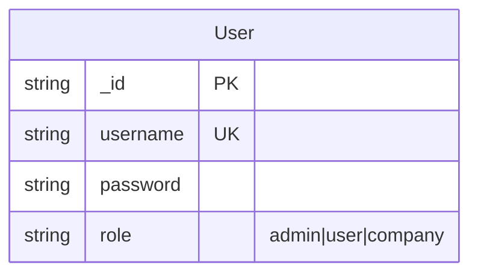

### Bảng UserProfile

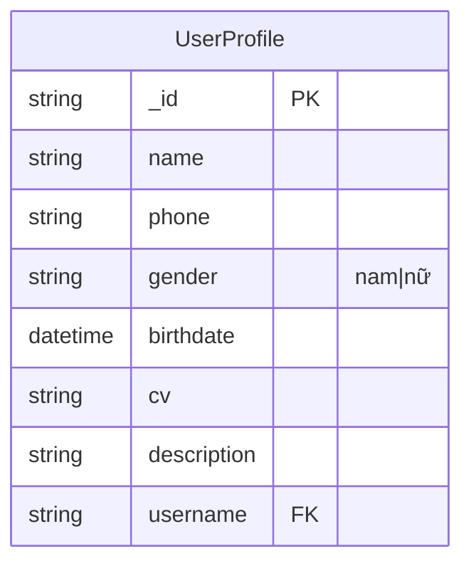

### Bảng Company

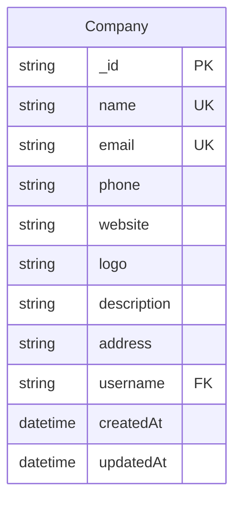

### Bảng JobDetail

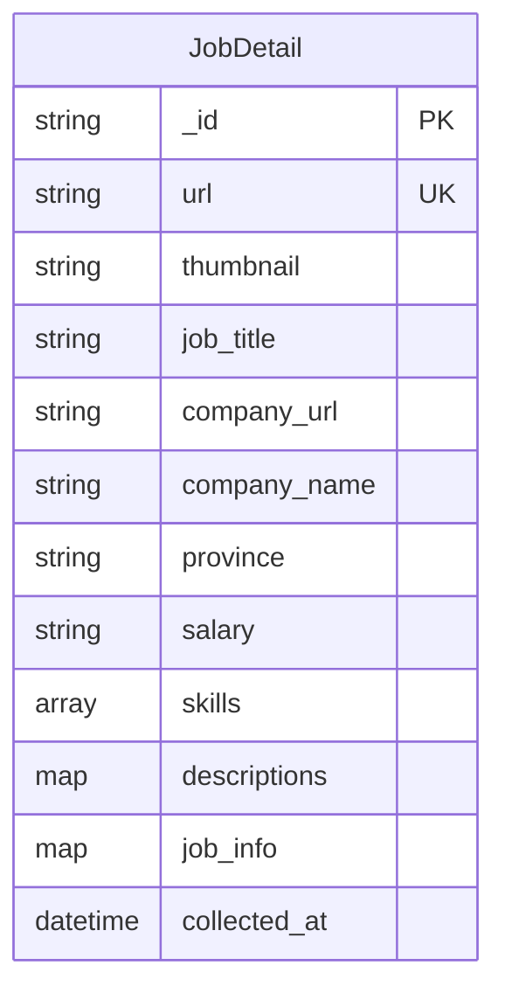

### Bảng ChatHistory

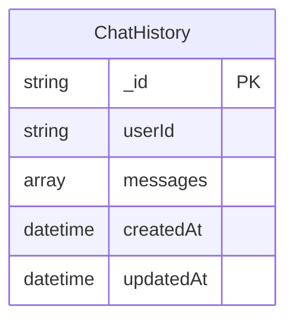

### Bảng Follow

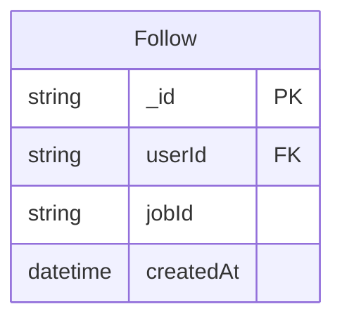

### Bảng Notification

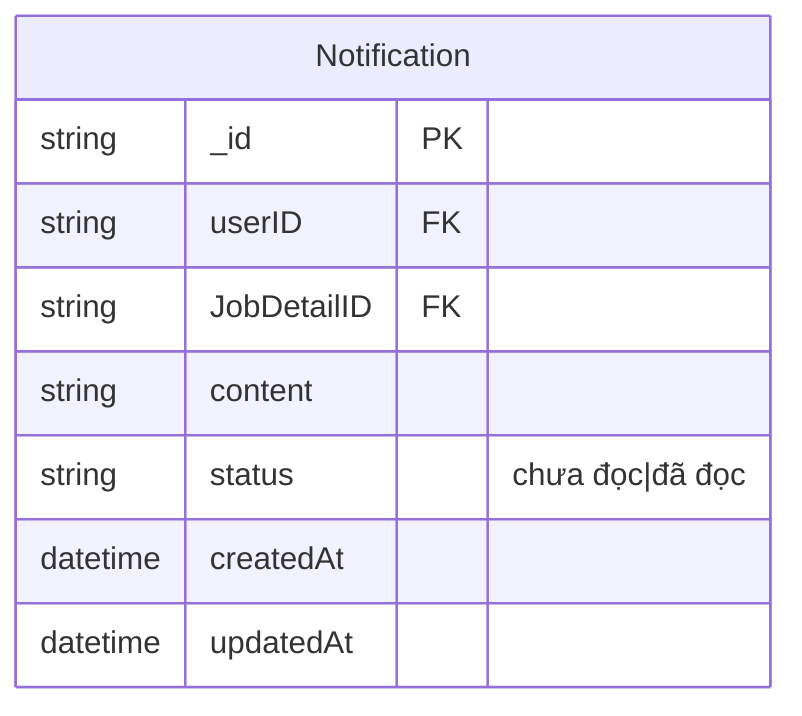

### Bảng User_company

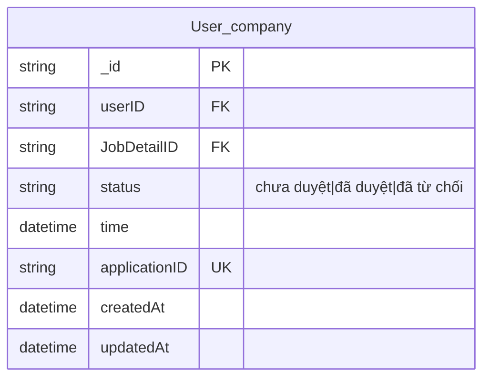

### Bảng ScrapeJob

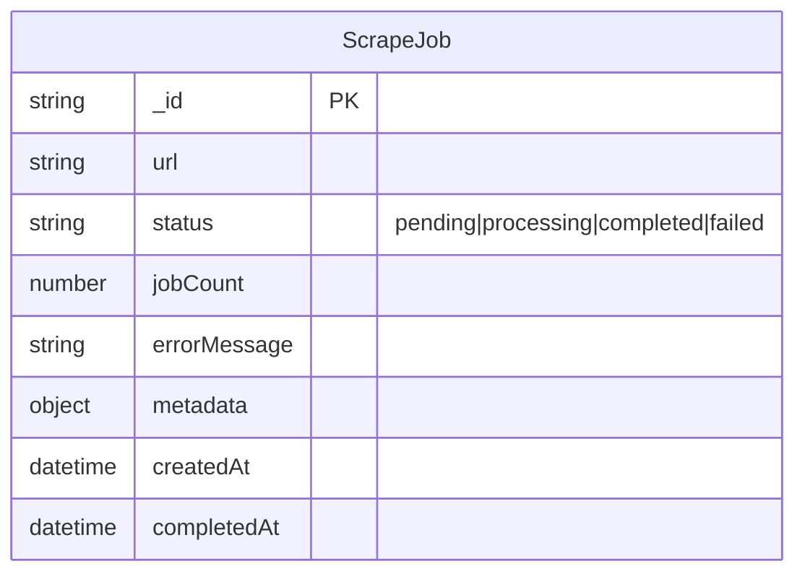

## Kiến trúc dự án

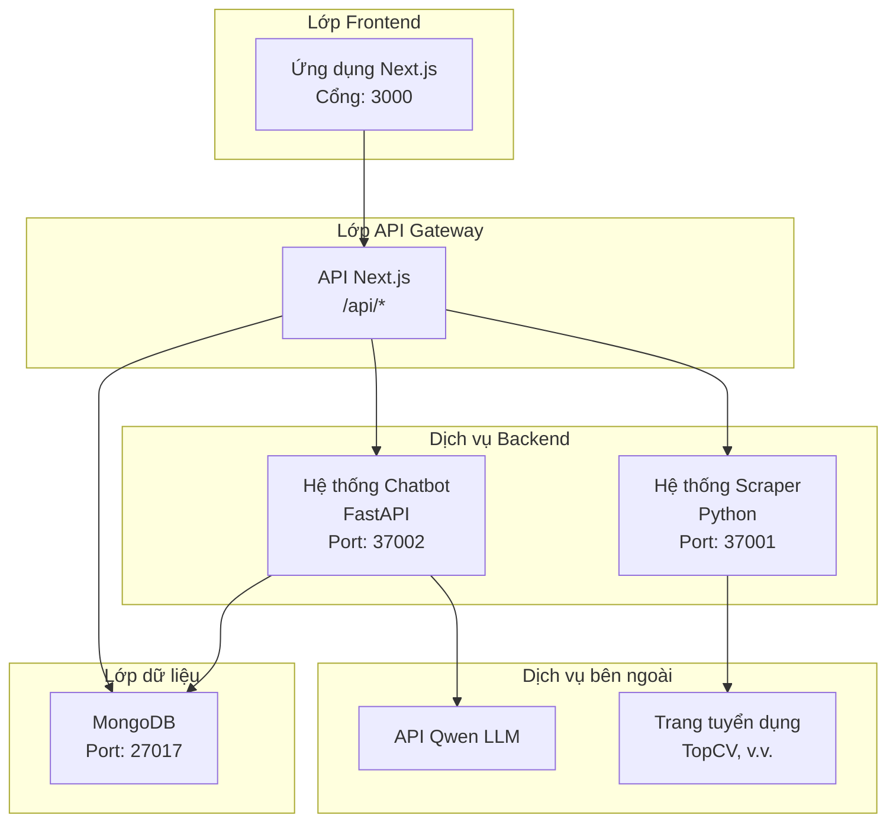
