# CHƯƠNG 2: PHÂN TÍCH VÀ THIẾT KẾ HỆ THỐNG

## 2.1. PHÁT BIỂU BÀI TOÁN

### 2.1.1. Các vấn đề cần giải quyết

Cần là xây dựng một nền tảng tuyển dụng toàn diện giải quyết các vấn đề sau:

**Vấn đề kết nối:** Thiếu nền tảng tập trung và hiệu quả để kết nối người tìm việc với nhà tuyển dụng, dẫn đến mất thời gian và cơ hội.

**Vấn đề quản lý dữ liệu:** Thiếu công cụ tự động thu thập và cập nhật dữ liệu việc làm, khiến cơ sở dữ liệu trở nên lỗi thời và không đầy đủ.

**Vấn đề trải nghiệm người dùng:** Quy trình ứng tuyển phức tạp, thiếu thông báo real-time, và giao diện không tối ưu cho người dùng Việt Nam.

**Vấn đề quản trị:** Thiếu công cụ quản lý và giám sát hệ thống hiệu quả, đặc biệt trong việc thu thập dữ liệu tự động.

### 2.1.3. Mục tiêu và yêu cầu của hệ thống

**Mục tiêu chính:** Phát triển một nền tảng tuyển dụng việc làm toàn diện, tích hợp các công nghệ hiện đại để kết nối hiệu quả giữa ứng viên và nhà tuyển dụng, đồng thời cung cấp các công cụ hỗ trợ quản trị tiên tiến.

**Yêu cầu chức năng chính:**

- Hệ thống xác thực và phân quyền cho ba loại người dùng (người tìm việc, công ty, quản trị viên)
- Chức năng tìm kiếm, ứng tuyển và theo dõi công việc cho người tìm việc
- Chức năng quản lý tin tuyển dụng và hồ sơ ứng viên cho công ty
- Công cụ thu thập dữ liệu việc làm tự động cho quản trị viên
- Hệ thống thông báo real-time và quản lý file

**Yêu cầu phi chức năng:**

- Hiệu suất cao với khả năng xử lý đồng thời nhiều người dùng
- Bảo mật thông tin cá nhân và dữ liệu doanh nghiệp
- Khả năng mở rộng để đáp ứng tăng trưởng người dùng
- Giao diện thân thiện và responsive trên nhiều thiết bị
- Độ tin cậy cao với thời gian uptime 99.9%

**Các hệ thống chính:**

**Hệ thống nền tảng tuyển dụng:**

- Cung cấp giao diện thân thiện cho ứng viên tìm kiếm, ứng tuyển và theo dõi trạng thái đơn
- Hỗ trợ nhà tuyển dụng quản lý tin tuyển dụng và hồ sơ ứng viên chuyên nghiệp
- Tích hợp hệ thống thông báo real-time để nâng cao trải nghiệm người dùng
- Cung cấp công cụ quản trị với khả năng thu thập dữ liệu việc làm tự động

**Hệ thống công cụ hỗ trợ (tùy chọn):**

- Công cụ tùy chỉnh bàn phím cho người dùng nâng cao năng suất làm việc

### 2.1.4. Cơ sở cho thiết kế

Từ phát biểu bài toán trên, việc thiết kế hệ thống được xây dựng trên các nguyên tắc sau:

**Nguyên tắc thiết kế chức năng:**

- Thiết kế theo use case với trọng tâm vào trải nghiệm người dùng cuối
- Tách biệt rõ ràng vai trò và quyền hạn của từng loại người dùng
- Ưu tiên các chức năng cốt lõi: tìm kiếm, ứng tuyển, quản lý dữ liệu

**Nguyên tắc thiết kế kỹ thuật:**

- Áp dụng kiến trúc microservices để đảm bảo tính mở rộng và bảo trì
- Sử dụng công nghệ web hiện đại (Next.js, MongoDB) cho hiệu suất cao
- Tích hợp công cụ thu thập dữ liệu tự động (Scrapy) để duy trì dữ liệu chất lượng

**Nguyên tắc thiết kế dữ liệu:**

- Mô hình dữ liệu quan hệ rõ ràng với các thực thể chính: User, Company, JobDetail, v.v.
- Đảm bảo tính toàn vẹn dữ liệu với khóa chính và khóa ngoại phù hợp
- Hỗ trợ lưu trữ file và metadata cho CV và hình ảnh

Phần phát biểu bài toán này tạo nền tảng vững chắc cho các phần thiết kế tiếp theo trong chương, đảm bảo mọi quyết định thiết kế đều xuất phát từ nhu cầu thực tế và giải quyết trực tiếp các vấn đề đã xác định.

## 2.2. PHÂN TÍCH HIỆN TRẠNG VÀ GIẢI PHÁP ĐỀ XUẤT

### 2.2.1. Phân tích các giải pháp hiện có

**Các nền tảng tuyển dụng truyền thống tại Việt Nam (VietnamWorks, CareerBuilder, TopCV):**

- Ưu điểm: Cơ sở dữ liệu lớn, giao diện thân thiện, nhiều tính năng cơ bản
- Nhược điểm: Thiếu tính năng thông báo real-time, quản lý ứng tuyển còn thủ công, không có công cụ thu thập dữ liệu tự động

**Các nền tảng quốc tế (LinkedIn, Indeed):**

- Ưu điểm: Tích hợp mạng lưới chuyên nghiệp, nhiều tính năng cao cấp
- Nhược điểm: Phức tạp cho người dùng Việt Nam, chi phí cao, không tối ưu cho thị trường lao động địa phương

### 2.2.2. Giải pháp đề xuất

Hệ thống PBL4 được thiết kế để khắc phục các hạn chế của các giải pháp hiện có thông qua:

- **Công cụ thu thập dữ liệu tự động:** Cho phép quản trị viên thu thập dữ liệu việc làm từ nhiều nguồn một cách hiệu quả
- **Kiến trúc microservices:** Đảm bảo tính mở rộng, bảo trì và triển khai độc lập các module
- **Hệ thống thông báo real-time:** Cập nhật trạng thái ngay lập tức cho người dùng
- **Giao diện người dùng tối ưu:** Thiết kế responsive, dễ sử dụng cho cả ứng viên và nhà tuyển dụng

## 2.3. PHÂN TÍCH CHỨC NĂNG

### 2.3.1. Đối tượng người dùng và vai trò

Hệ thống phục vụ ba nhóm đối tượng chính với các vai trò và quyền hạn cụ thể:

**1. Người tìm việc (User):**

- Chức năng chính: Tìm kiếm việc làm, ứng tuyển, quản lý hồ sơ cá nhân
- Quyền hạn: Xem và tìm kiếm công việc, nộp đơn ứng tuyển, theo dõi trạng thái, nhận thông báo

**2. Công ty (Company):**

- Chức năng chính: Đăng tin tuyển dụng, quản lý hồ sơ ứng viên
- Quyền hạn: CRUD tin tuyển dụng, xem và xử lý đơn ứng tuyển, quản lý thông tin công ty

**3. Quản trị viên (Admin):**

- Chức năng chính: Quản lý toàn bộ hệ thống, thu thập dữ liệu việc làm
- Quyền hạn: Quản lý người dùng, công ty, tin tuyển dụng; sử dụng công cụ thu thập dữ liệu; giám sát hệ thống

### 2.3.2. Use Case Diagrams

#### Use Case Tổng quan

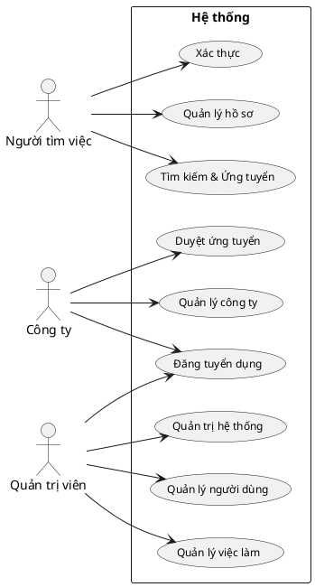

*Hình 2.1. Sơ đồ Use Case Tổng quan*

#### Use Case Chi tiết - Người tìm việc (Xác thực và Hồ sơ)

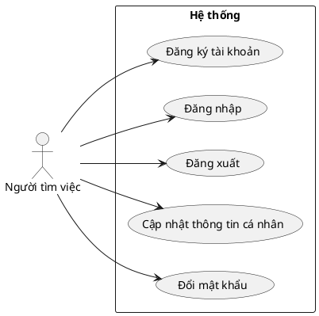

*Hình 2.2a. Sơ đồ Use Case - Xác thực và Hồ sơ*

#### Use Case Chi tiết - Người tìm việc (Tìm kiếm và Ứng tuyển)

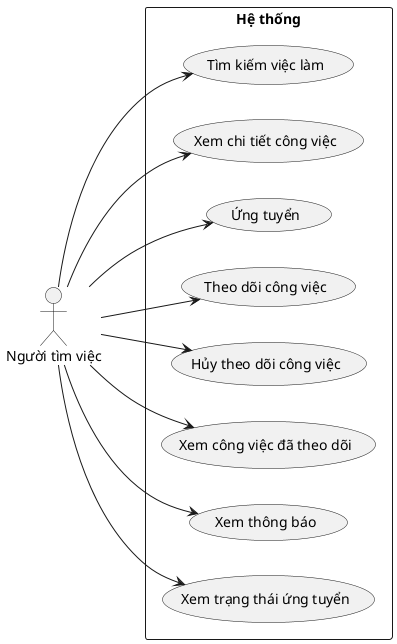

*Hình 2.2b. Sơ đồ Use Case - Tìm kiếm và Ứng tuyển*

#### Use Case Chi tiết - Công ty (Quản lý Hồ sơ và Công việc)

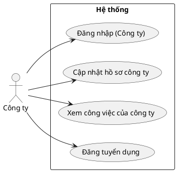

*Hình 2.3a. Sơ đồ Use Case - Quản lý Hồ sơ và Công việc*

#### Use Case Chi tiết - Công ty (Xử lý Ứng tuyển)

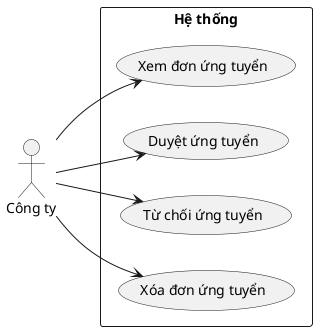

*Hình 2.3b. Sơ đồ Use Case - Xử lý Ứng tuyển*

#### Use Case Chi tiết - Quản trị viên (Xác thực và Quản lý Người dùng)

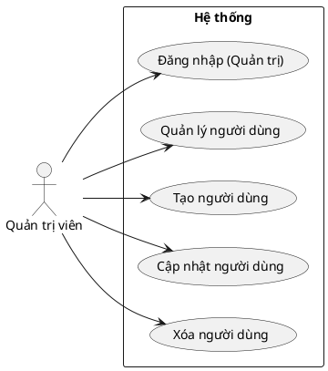

*Hình 2.4a. Sơ đồ Use Case - Xác thực và Quản lý Người dùng*

#### Use Case Chi tiết - Quản trị viên (Quản lý Công ty)

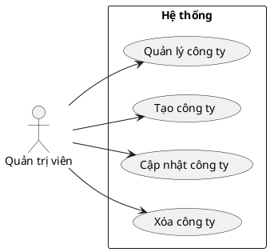

*Hình 2.4b. Sơ đồ Use Case - Quản lý Công ty*

#### Use Case Chi tiết - Quản trị viên (Quản lý Công việc và Thông báo)

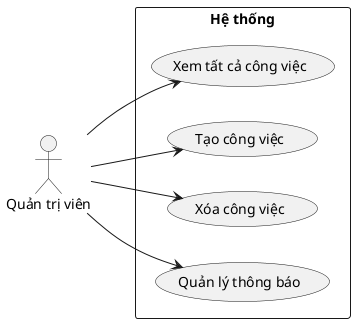

*Hình 2.4c. Sơ đồ Use Case - Quản lý Công việc và Thông báo*

#### Use Case Chi tiết - Quản trị viên (Công cụ và Giám sát)

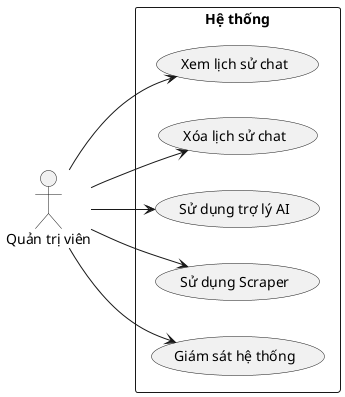

*Hình 2.4d. Sơ đồ Use Case - Công cụ và Giám sát*

### 2.3.3. Chi tiết các chức năng chính

**Nhóm chức năng xác thực và phân quyền:**

- Đăng ký tài khoản cho người dùng và công ty
- Đăng nhập với thông tin xác thực
- Phân quyền dựa trên vai trò (user, company, admin)
- Quản lý phiên đăng nhập và bảo mật

**Nhóm chức năng quản lý hồ sơ:**

- CRUD thông tin cá nhân cho người tìm việc (họ tên, liên hệ, CV, kỹ năng)
- CRUD thông tin công ty (tên, logo, mô tả, địa chỉ)
- Upload và quản lý file CV

**Nhóm chức năng tìm kiếm và ứng tuyển:**

- Tìm kiếm công việc theo từ khóa, địa điểm, lương, kỹ năng
- Lọc và sắp xếp kết quả tìm kiếm
- Xem chi tiết thông tin công việc
- Ứng tuyển nhanh với một click
- Theo dõi/bỏ theo dõi công việc quan tâm

**Nhóm chức năng quản lý tuyển dụng:**

- Đăng và chỉnh sửa tin tuyển dụng
- Xem danh sách đơn ứng tuyển
- Duyệt hoặc từ chối đơn ứng tuyển
- Thống kê và báo cáo tuyển dụng

**Nhóm chức năng thông báo:**

- Tạo thông báo tự động khi có cập nhật
- Hiển thị danh sách thông báo cho người dùng
- Đánh dấu trạng thái đã đọc/chưa đọc

**Nhóm chức năng quản trị hệ thống:**

- CRUD cho tất cả entities (users, companies, jobs)
- Công cụ thu thập dữ liệu việc làm từ web
- Giám sát và thống kê hệ thống
- Quản lý thông báo toàn hệ thống

## 2.4. THIẾT KẾ CƠ SỞ DỮ LIỆU

### 2.4.1. Sơ đồ quan hệ thực thể (ERD)

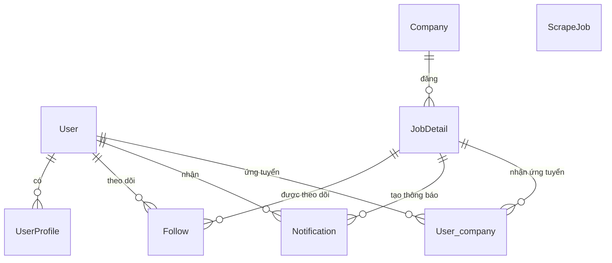

*Hình 2.5. Sơ đồ ERD

### 2.4.2. Chi tiết các bảng

#### Bảng User

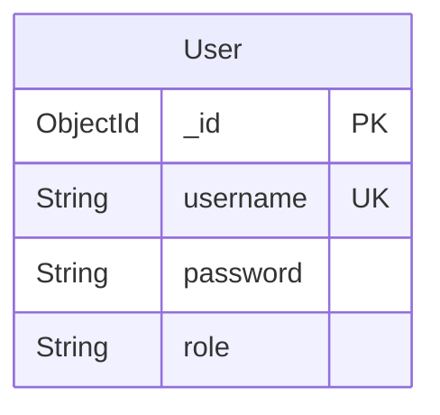

#### Bảng UserProfile

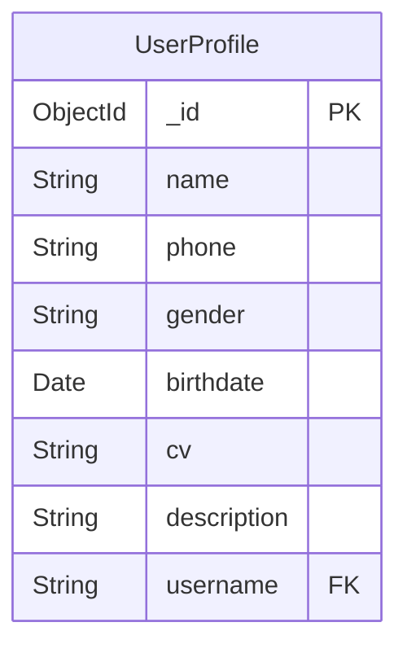

#### Bảng Company

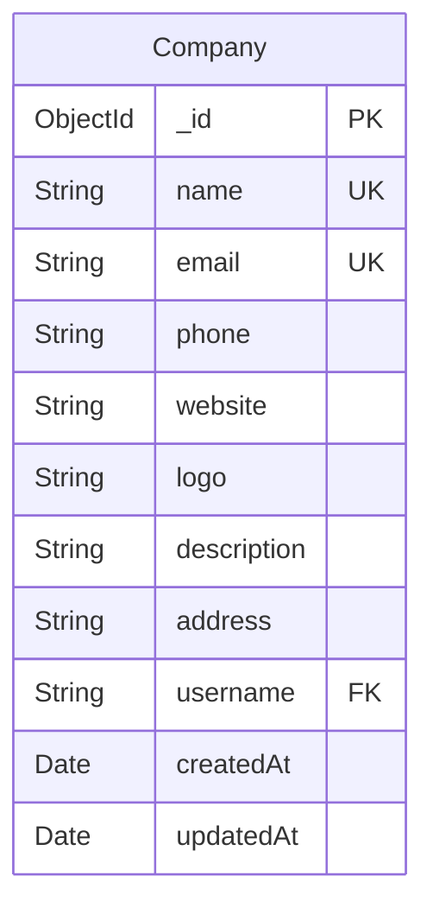

#### Bảng JobDetail

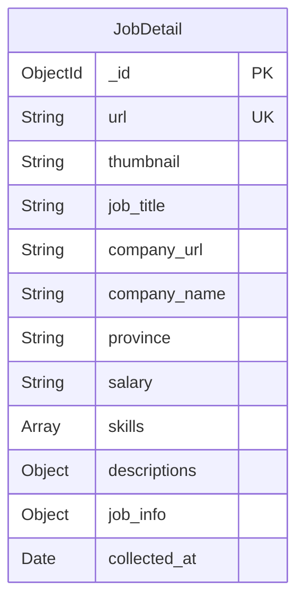

#### Bảng Follow

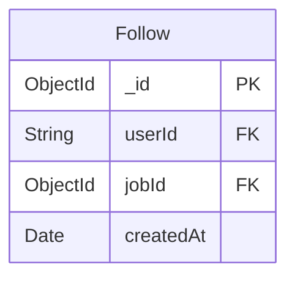

#### Bảng Notification

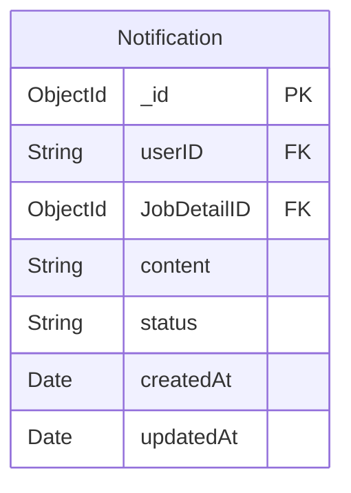

#### Bảng User_company

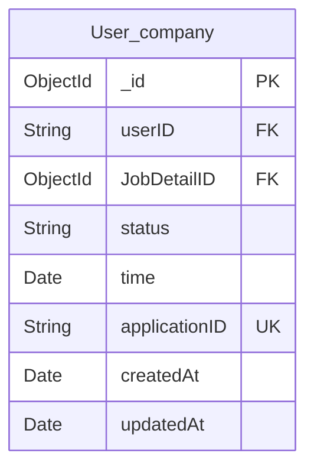

#### Bảng ScrapeJob

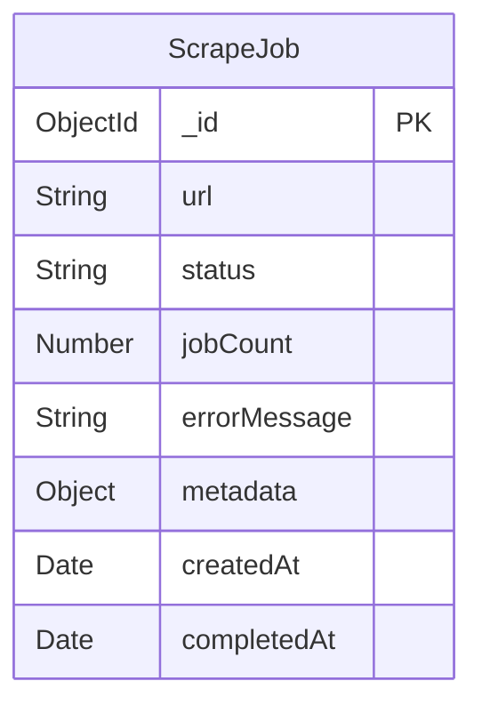

## 2.5. THIẾT KẾ KIẾN TRÚC HỆ THỐNG

### 2.5.1. Kiến trúc tổng thể

Hệ thống được thiết kế theo mô hình microservices với các service độc lập:

- **Frontend Service:** Next.js application phục vụ giao diện người dùng
- **API Gateway:** Next.js API routes xử lý business logic chính
- **Scraper Service:** Python/FastAPI service chuyên biệt cho việc thu thập dữ liệu
- **Database:** MongoDB làm kho dữ liệu tập trung
- **File Storage:** Service quản lý các tệp upload/download

### 2.5.2. Chức năng xử lý thu thập dữ liệu (Scraper)

Scraper trong hệ thống có vai trò tự động thu thập và cập nhật dữ liệu việc làm từ các nguồn bên ngoài để làm phong phú cơ sở dữ liệu hệ thống.

**Chức năng chính:**

- Quản trị viên nhập URL nguồn cần thu thập
- Tạo job thu thập với trạng thái theo dõi
- Thực hiện crawl dữ liệu sử dụng Scrapy
- Cập nhật trạng thái real-time qua polling
- Nhận kết quả và lưu vào database
- Thông báo kết quả cho quản trị viên

**Quy trình thực hiện**:

- Quản trị viên nhập URL nguồn cần thu thập vào giao diện admin. Hệ thống tạo bản ghi ScrapeJob với trạng thái "pending".
- Hệ thống gửi yêu cầu đến Scraper Service thông qua API call. Scraper Service khởi tạo spider Scrapy với URL được cung cấp.
- Spider bắt đầu crawl trang web, phân tích HTML và trích xuất thông tin việc làm. Dữ liệu được validate và chuẩn hóa theo schema định sẵn.
- Dữ liệu thu thập được gửi về API Gateway để lưu vào MongoDB. Mỗi job được lưu vào collection JobDetail với timestamp.
- Hệ thống cập nhật trạng thái ScrapeJob thành "completed" và ghi nhận số lượng job thu thập được. Thông báo được gửi đến admin.
- Nếu có lỗi xảy ra, trạng thái chuyển thành "failed" với thông báo lỗi chi tiết để admin xử lý.

### 2.5.3. Chức năng ứng tuyển của người dùng

Chức năng ứng tuyển cho phép người tìm việc nộp đơn ứng tuyển vào các vị trí công việc một cách nhanh chóng và theo dõi trạng thái xử lý.

**Quy trình thực hiện:**

- Người dùng xem chi tiết công việc và nhấn nút "Ứng tuyển"
- Hệ thống kiểm tra xác thực người dùng qua JWT token
- Kiểm tra xem người dùng đã ứng tuyển vị trí này chưa để tránh trùng lặp
- Tạo bản ghi mới trong collection User_company với:
  - userID: ID của người dùng
  - JobDetailID: ID của công việc
  - status: "chưa duyệt" (mặc định)
  - time: thời gian ứng tuyển (hiện tại)
- Trả về thông báo thành công cho người dùng

**Quy trình theo dõi ứng tuyển:**

- Người dùng có thể xem danh sách các đơn ứng tuyển của mình
- Hệ thống populate thông tin chi tiết công việc từ JobDetail
- Hiển thị trạng thái xử lý: chưa duyệt, đã duyệt, đã từ chối
- Sắp xếp theo thời gian ứng tuyển (mới nhất trước)

**Đặc điểm kỹ thuật:**

- Sử dụng Mongoose để tương tác với MongoDB
- Index trên userID và JobDetailID để tối ưu truy vấn
- Xử lý lỗi và validation đầy đủ
- API endpoints: POST /api/user/apply (tạo ứng tuyển), GET /api/user/apply (xem ứng tuyển)

### 2.5.4. Chức năng tạo bài đăng của công ty

Chức năng tạo bài đăng cho phép công ty đăng tin tuyển dụng mới vào hệ thống để thu hút ứng viên.

**Quy trình tạo bài đăng:**

- Công ty nhập thông tin chi tiết công việc qua form admin
- Hệ thống validate các trường bắt buộc (tên công việc, tỉnh/thành)
- Tự động tạo URL unique cho bài đăng dựa trên tiêu đề và timestamp
- Lưu thông tin vào collection JobDetail với các trường:
  - job_title: Tên vị trí
  - company_name: Tên công ty
  - province: Địa điểm làm việc
  - salary: Mức lương
  - skills: Danh sách kỹ năng yêu cầu
  - descriptions: Mô tả chi tiết công việc
  - job_info: Thông tin bổ sung
  - collected_at: Thời gian tạo
- Trả về thông báo thành công và dữ liệu bài đăng

**Đặc điểm kỹ thuật:**

- API endpoint: POST /api/jobDetail
- Validation phía server cho dữ liệu đầu vào
- Tự động tạo slug URL từ tiếng Việt (loại dấu, chuyển thành URL-friendly)
- Sử dụng Map type của MongoDB cho descriptions và job_info linh hoạt
- Index trên url để đảm bảo unique và truy vấn nhanh

### 2.5.5. Công nghệ sử dụng

**Frontend:**

- Next.js 15+ (React framework)
- Tailwind CSS (styling)
- React components cho UI

**Backend:**

- Next.js API Routes (main API)
- FastAPI (microservices)
- MongoDB (database)

**Công cụ crawl:**

- Scrapy (web scraping framework)
- Python requests/beautifulsoup

**Triển khai:**

- Môi trường Node.js, Python

## 2.6. XÂY DỰNG CHƯƠNG TRÌNH

### Tổ chức thư mục

```
pbl4/
├── client_server/          # Frontend Next.js + API backend
│   ├── app/                 # Thư mục ứng dụng Next.js
│   │   ├── api/            # Các route API
│   │   ├── admin/          # Các trang quản trị
│   │   ├── user/           # Các trang người dùng
│   │   └── components/     # Các component React
│   ├── models/             # Các schema Mongoose
│   ├── lib/                # Tiện ích và cấu hình
│   └── package.json
├── scraper/                # Dịch vụ thu thập dữ liệu
│   ├── main.py
│   └── src/
│       ├── spiders/        # Các spider Scrapy
│       └── util.py
├── database/               # Tiện ích cơ sở dữ liệu
│   └── seed/               # Dữ liệu mẫu
├── file_system/            # Dịch vụ lưu trữ file
│   ├── main.py
│   └── var/
│       ├── cv/             # File CV
│       └── uploads/        # File đã tải lên
├── scripts/                # Script tiện ích
│   ├── db.sh
│   ├── env.sh
│   └── test.sh
├── test/                   # File kiểm thử
├── ubuntu/                 # Triển khai Ubuntu
├── windows/                # Triển khai Windows
├── ARCHITECTURE.md
├── CHAPTER-2.md
├── README.md
└── requirements.txt
```

#### Tập tin/module 01: client_server/

- **Mô tả:** Module chính của hệ thống chứa frontend Next.js và các API backend
- **Chức năng:** Xử lý giao diện người dùng, xác thực, quản lý dữ liệu, API endpoints
- **Công nghệ:** Next.js 15+, React, MongoDB, JWT authentication
- **Cấu trúc:**
  - app/: Pages và API routes
  - models/: Schema dữ liệu Mongoose
  - lib/: Các tính năng phụ trợ và cấu hình

#### Tập tin/module 02: scraper/

- **Mô tả:** Module thu thập dữ liệu việc làm tự động từ web
- **Chức năng:** Crawl dữ liệu từ các trang tuyển dụng, validate và lưu vào database
- **Công nghệ:** Python, Scrapy, FastAPI
- **Cấu trúc:**
  - main.py: Tệp chương trình chính
  - src/: Chứa các chức năng crawl dữ liệu và các phụ trợ

#### Tập tin/module 03: database/

- **Mô tả:** Quản lý dữ liệu mẫu và seed cho hệ thống
- **Chức năng:** Cung cấp dữ liệu test và khởi tạo database
- **Công nghệ:** Các tệp MongoDB BSON
- **Cấu trúc:**
  - seed/: Dữ liệu mẫu cho các collections

#### Tập tin/module 04: file_system/

- **Mô tả:** Module quản lý lưu trữ file tập trung
- **Chức năng:** Upload, download và serve file tĩnh (CV, ảnh)
- **Công nghệ:** Python FastAPI, file system operations
- **Cấu trúc:**
  - main.py: Server file handling
  - var/: Thư mục chứa các tệp upload

#### Tập tin/module 05: scripts/

- **Mô tả:** Các script tiện ích cho việc triển khai và kiểm thử
- **Chức năng:** Script tự động cho việc thiết lập, chạy và kiểm thử dự án
- **Công nghệ:** Mã Shell
- **Cấu trúc:**
  - env.sh: Thiết lập biến môi trường
  - test.sh: Kiểm thử chịu tải

## 2.7. KẾT LUẬN CHƯƠNG

Chương này đã trình bày một cách có hệ thống về phân tích và thiết kế hệ thống:

- **Xác định bài toán:** Phân tích nhu cầu thực tế của thị trường tuyển dụng
- **Phân tích giải pháp:** So sánh với các nền tảng hiện có và đề xuất giải pháp tối ưu
- **Thiết kế chức năng:** Chi tiết use cases cho ba đối tượng người dùng, đặc biệt nhấn mạnh vai trò quản trị viên trong việc thu thập dữ liệu
- **Thiết kế dữ liệu:** Mô hình cơ sở dữ liệu quan hệ rõ ràng
- **Thiết kế kiến trúc:** Kiến trúc microservices linh hoạt và mở rộng

Hệ thống được thiết kế để giải quyết các vấn đề cốt lõi của thị trường tuyển dụng, với trọng tâm là cung cấp nền tảng kết nối hiệu quả và công cụ quản trị mạnh mẽ cho việc thu thập dữ liệu việc làm.
