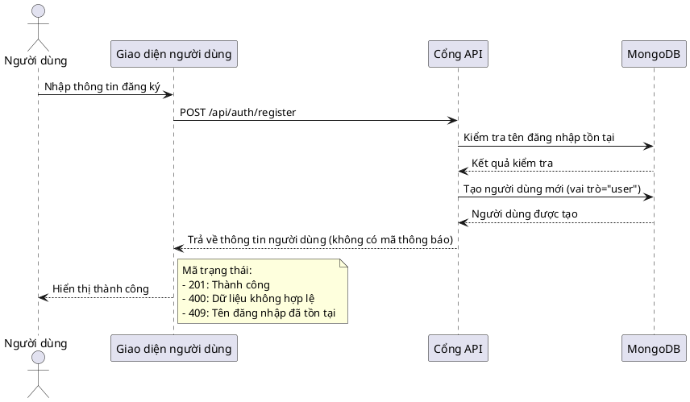
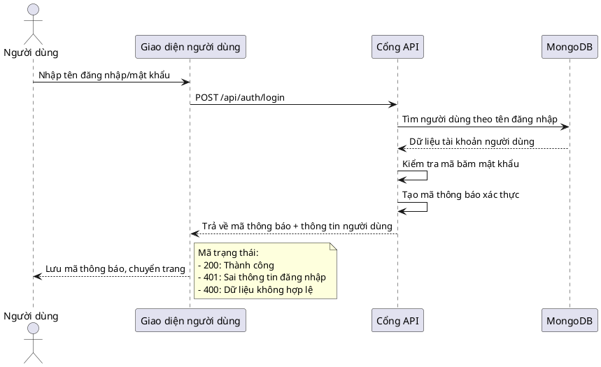
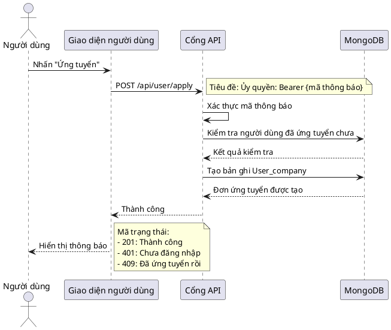
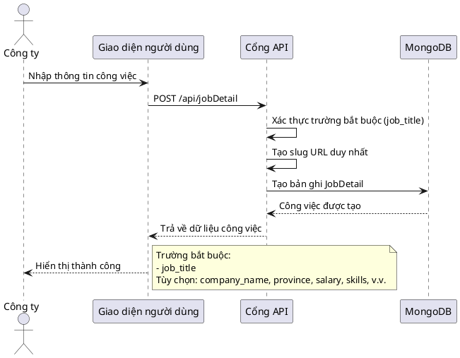
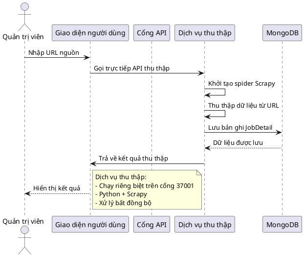
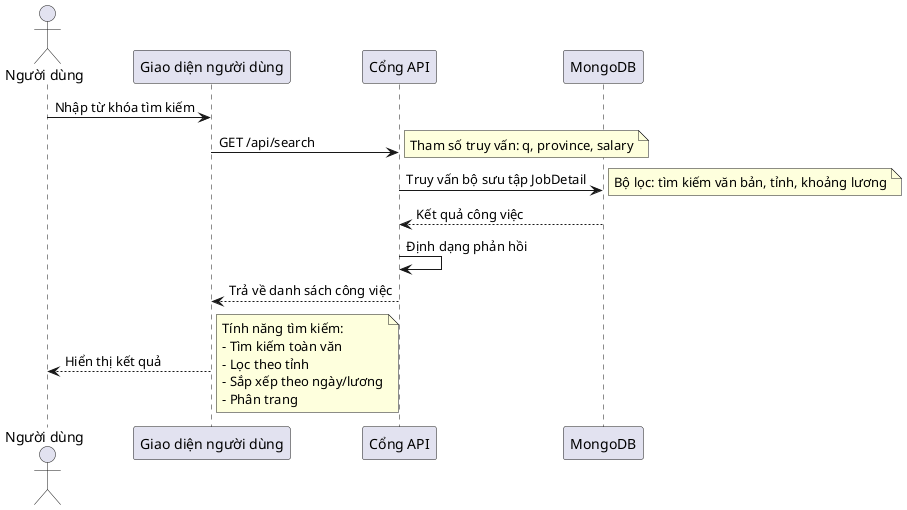
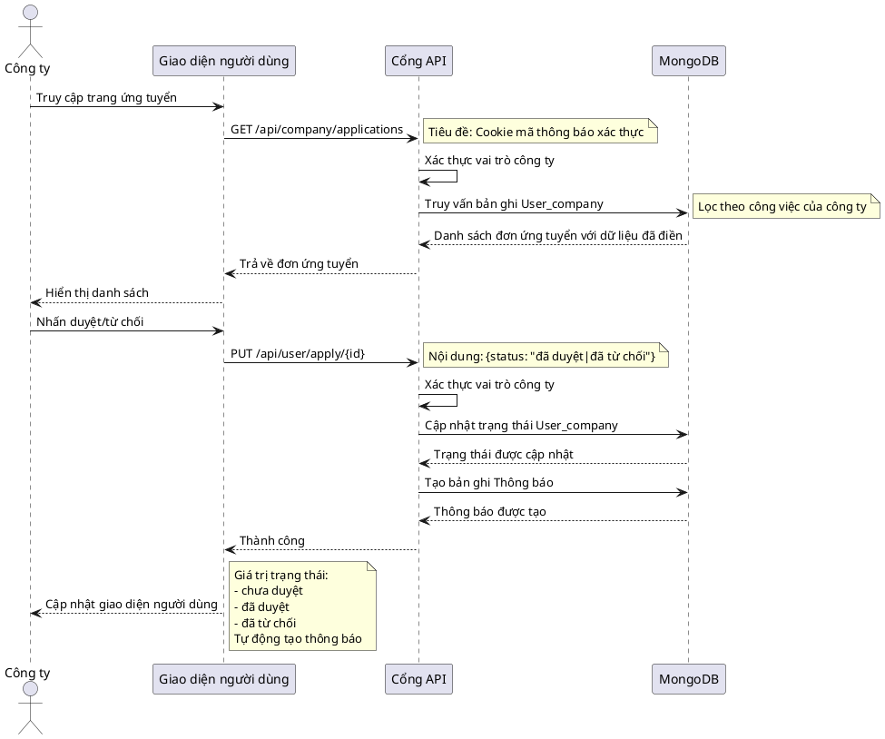
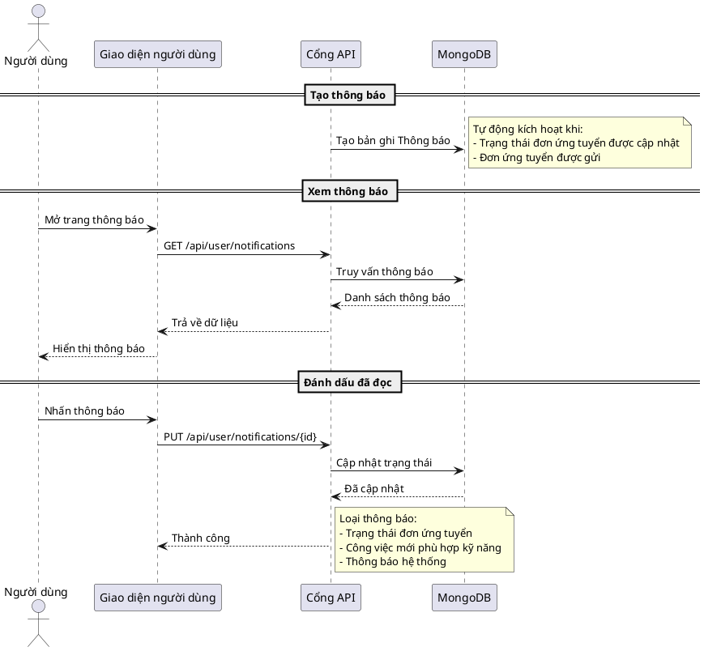

# SƠ ĐỒ TUẦN TỰ HỆ THỐNG PBL4

## 1. Sơ đồ tuần tự - Đăng ký tài khoản

## 2. Sơ đồ tuần tự - Đăng nhập hệ thống

## 3. Sơ đồ tuần tự - Ứng tuyển công việc

## 4. Sơ đồ tuần tự - Tạo bài đăng công việc (Công ty)

## 5. Sơ đồ tuần tự - Thu thập dữ liệu việc làm (Quản trị viên)

## 6. Sơ đồ tuần tự - Tìm kiếm công việc

## 7. Sơ đồ tuần tự - Xem và duyệt đơn ứng tuyển (Công ty)

## 8. Sơ đồ tuần tự - Quản lý thông báo

